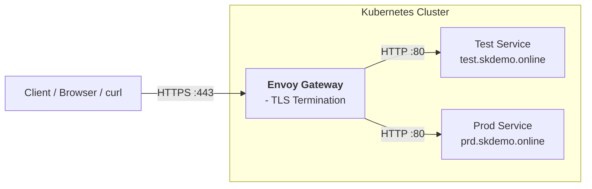

## Prerequisites

- Kubernetes cluster with **Envoy Gateway** installed
- Valid TLS certificate and private key  
  (example: wildcard certificate for `*.skdemo.online`)
- `kubectl` access to the cluster
- Gateway API CRDs installed

---

## Architecture Overview





## Architecture Overview


## 1. Create a TLS Secret in the Envoy Gateway Namespace

The TLS certificate and private key must be stored as a Kubernetes secret of type `kubernetes.io/tls`.

### Create the secret

```bash
kubectl create secret tls skdemo-wildcard-tls \
  --cert=skdemo.pem \
  --key=skdemo.key \
  -n envoy-gateway
```

### Verify secret creation

```bash
kubectl get secret skdemo-wildcard-tls -n envoy-gateway
```

### Example output:

```bash
NAME                  TYPE                DATA   AGE
skdemo-wildcard-tls   kubernetes.io/tls   2      13s
```

## 2. Create the Envoy Gateway Resource

The Gateway resource defines how traffic enters the cluster. In this setup:

    Port 80 is used for HTTP

    Port 443 is used for HTTPS with TLS termination

### Create Envoy Gateway API
    create gateway.yaml
```bash
apiVersion: gateway.networking.k8s.io/v1
kind: Gateway
metadata:
  name: gateway
  namespace: envoy-gateway
spec:
  gatewayClassName: envoy
  listeners:
    - name: http
      port: 80
      protocol: HTTP
      allowedRoutes:
        namespaces:
          from: All

    - name: https
      port: 443
      protocol: HTTPS
      allowedRoutes:
        namespaces:
          from: All
      tls:
        mode: Terminate
        certificateRefs:
          - name: skdemo-wildcard-tls
```

### Apply the Gateway configuration
```bash
kubectl apply -f gateway.yaml
```

## 3. Verify the Gateway Status

Verify that the Gateway has been successfully created and programmed by Envoy Gateway.

```bash
kubectl describe gateway gateway -n envoy-gateway
```
Output:
```bash
Name:         gateway
Namespace:    envoy-gateway
Labels:       <none>
Annotations:  <none>
API Version:  gateway.networking.k8s.io/v1
Kind:         Gateway
Metadata:
  Creation Timestamp:  2026-02-07T16:55:36Z
  Generation:          2
  Resource Version:    2270444
  UID:                 781a18b3-c889-4143-b457-71080f117177
Spec:
  Gateway Class Name:  envoy
  Listeners:
    Allowed Routes:
      Namespaces:
        From:  All
    Name:      http
    Port:      80
    Protocol:  HTTP
    Allowed Routes:
      Namespaces:
        From:  All
    Name:      https
    Port:      443
    Protocol:  HTTPS
    Tls:
      Certificate Refs:
        Group:
        Kind:   Secret
        Name:   skdemo-wildcard-tls
      Mode:     Terminate
Status:
  Addresses:
    Type:   IPAddress
    Value:  20.22.52.166
  Conditions:
    Last Transition Time:  2026-02-08T10:58:49Z
    Message:               The Gateway has been scheduled by Envoy Gateway
    Observed Generation:   2
    Reason:                Accepted
    Status:                True
    Type:                  Accepted
    Last Transition Time:  2026-02-08T10:58:49Z
    Message:               Address assigned to the Gateway, 1/1 envoy replicas available
    Observed Generation:   2
    Reason:                Programmed
    Status:                True
    Type:                  Programmed
  Listeners:
    Attached Routes:  3
    Conditions:
      Last Transition Time:  2026-02-08T10:58:49Z
      Message:               Sending translated listener configuration to the data plane
      Observed Generation:   2
      Reason:                Programmed
      Status:                True
      Type:                  Programmed
      Last Transition Time:  2026-02-08T10:58:49Z
      Message:               Listener has been successfully translated
      Observed Generation:   2
      Reason:                Accepted
      Status:                True
      Type:                  Accepted
      Last Transition Time:  2026-02-08T10:58:49Z
      Message:               Listener references have been resolved
      Observed Generation:   2
      Reason:                ResolvedRefs
      Status:                True
      Type:                  ResolvedRefs
    Name:                    http
    Supported Kinds:
      Group:          gateway.networking.k8s.io
      Kind:           HTTPRoute
      Group:          gateway.networking.k8s.io
      Kind:           GRPCRoute
    Attached Routes:  3
    Conditions:
      Last Transition Time:  2026-02-08T10:58:49Z
      Message:               Sending translated listener configuration to the data plane
      Observed Generation:   2
      Reason:                Programmed
      Status:                True
      Type:                  Programmed
      Last Transition Time:  2026-02-08T10:58:49Z
      Message:               Listener has been successfully translated
      Observed Generation:   2
      Reason:                Accepted
      Status:                True
      Type:                  Accepted
      Last Transition Time:  2026-02-08T10:58:49Z
      Message:               Listener references have been resolved
      Observed Generation:   2
      Reason:                ResolvedRefs
      Status:                True
      Type:                  ResolvedRefs
    Name:                    https
    Supported Kinds:
      Group:  gateway.networking.k8s.io
      Kind:   HTTPRoute
      Group:  gateway.networking.k8s.io
      Kind:   GRPCRoute
Events:       <none>
```

## 4. HTTPRoute Configuration

No changes are required in existing HTTPRoute resources.

### Reason:
TLS termination happens at the Gateway level, so backend services continue to receive plain HTTP traffic.

## 5. Access the Application Over HTTPS

Once the Gateway is programmed, applications can be accessed securely using HTTPS.

### Test using curl

    Note: The -k option skips certificate verification.
    This is acceptable for testing or self-signed certificates but not recommended for production clients.

```bash
curl -k https://test.skdemo.online/

Example response:

<html>
  <body>
    <h1>This is TEST</h1>
    <p>Welcome to nginx!</p>
  </body>
</html>
```
```bash
curl -k https://prd.skdemo.online/

Example response:

<html>
  <body>
    <h1>This is PRD</h1>
    <p>Welcome to nginx!</p>
  </body>
</html>
```

## Summary

    - TLS certificates are stored as Kubernetes secrets

    - Envoy Gateway terminates TLS on port 443

    - No changes are required in application routes

    - HTTPS access is enabled through the Gateway